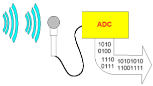
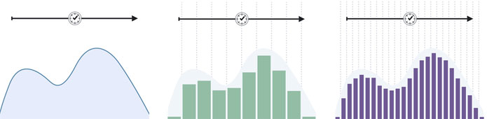

# AQA CS AS Notes

## 3.5 Fundamentals of Data Representation

**[Bourne to Code Link](https://bournetocode.com/projects/AQA_AS_Theory/pages/3-5.html)**

## 3.5.1 Number Systems
**Natural Numbers**
+ Definition: These are numbers used for counting.
+ Examples: 0, 1, 2, 3, 4
``` 
Counting uses natural number
A set of natural number can expressed as:
N={0,1,2,3...}

```

**Integer Numbers**
+ Definition: Any whole number.
+ Examples: -2, -1, 0, 1, 2

**Rational Numbers**
+ Definition: Any number that can be written as a fraction
+ Examples: -1, 0, 1.2, 1/3, 5.5

**Irrational Numbers**
+ Definition: Any number that cannot be written as a fraction
+ Examples: π, √2, √3

**Real numbers**
+ Definition: Any possible real world quantities
+ Examples: √2, 1.23, 3.142, -3, -2, -1, 0, 111, 245.56, 3

**Ordinal numbers**
+ Definition: Used to tell the position of something in a list
+ Examples: List = (a, b, c, d)
	+ *'a' is the 1st object in the list, 'b' is the 2nd object in the list, etc...*


## 3.5.2 Number Bases
**Base 2**
+ Definition: These are binary numbers and are only made of 2 digits (0 and 1). 
+ Place Values: 2<sup>0</sup>, 2<sup>1</sup>, 2<sup>2</sup>, 2<sup>3</sup>, etc...
+ Example: 1010<sub>2</sub>

**Base 10**
+ Definition: These are decimal/denary numbers which use 10 digits to make up their numbers
+ Place Values: 10<sup>0</sup>, 10<sup>1</sup>, 10<sup>2</sup>, 10<sup>3</sup>, etc...
+ Example: 26<sub>10</sub>

**Base 16**
+ Definition: These are hexadecimal numbers
+ Symbols: 0, 1, 2, 3, 4, 5, 6, 7, 8, 9, A, B, C, D, E, F

**Conversion Between Denary, Binary and Hex**

| Binary | Hexadecimal | Decimal |
|--------|-------------|---------|
| 0000   | 0           | 0       |
| 0001   | 1           | 1       |
| 0010   | 2           | 2       |
| 0011   | 3           | 3       |
| 0100   | 4           | 4       |
| 0101   | 5           | 5       |
| 0110   | 6           | 6       |
| 0111   | 7           | 7       |
| 1000   | 8           | 8       |
| 1001   | 9           | 9       |
| 1010   | A           | 10      |
| 1011   | B           | 11      |
| 1100   | C           | 12      |
| 1101   | D           | 13      |
| 1110   | E           | 14      |
| 1111   | F           | 15      |

+ For example: 10101101
	+ Split into nibbles - 1010 1101 ---> Convert each to decimal - 10 13 ---> Convert each to hex - AD

## 3.5.3 Units of Information
**Bits and Bytes**
+ A **bit** is either a 0 or 1
	+ Binary numbers are made up of bits
	+ A **byte** is made up of a group of 8 bits
	+ A **nibble** is a made up of a group of 4 bits
	
**Kilobytes and Kibibytes**
+ A kilobyte is 1000 (10<sup>3</sup>) bytes
+ A kibibyte is 1024 (2<sup>10</sup>) bytes
	+ Kibi is the **ki**lo in **bi**nary

| Kilobyte (KB) | 1000   | Kibibyte (KiB) | 1024   |
|---------------|--------|----------------|--------|
| **Megabyte (MB)** | **1000<sup>2</sup>** | **Mebibyte (MiB)** | **1024<sup>2</sup>** |
| **Gigabyte (GB)** | **1000<sup>3</sup>** | **Gibibyte (GiB)** | **1024<sup>3</sup>** |
| **Terabyte (TB)** | **1000<sup>4</sup>** | **Tebibyte (TiB)** | **1024<sup>4</sup>** |
| **Petabyte (PB)** | **1000<sup>5</sup>** | **Pebibyte (PiB)** | **1024<sup>5</sup>** |
	 
  	  	  	 
## 3.5.4 Binary Number System
**Unsigned Binary**
+ These do not have a bit to indicate that they are positive or negative numbers.
+ An 8 bit **unsigned binary** number has a max value of 255 and there are 256 (2<sup>8</sup>) different values

**Unsigned Binary Arithmetics**
+ Binary addition rules:
	+ 0+0=0
	+ 0+1=1
	+ 1+1=10 (meaning the 1 is carried over and the number stays as 0)
	+ 1+1+1=10+1=11 (meaning the 1 is carried over and the number becomes 1)
+ Addition:
``` Examples
 1010                               1010
+0010                              +1111
  1< carry over the bit              1<
-----                               1< carry over the bits
 1100                              -----
                                   11000
```                                
+ Binary multiplication rules:
	+ 0x0=0
	+ 1x1=1
	+ 0x1=0
+ Multiplication:
``` Examples
   11                               1010
  x10                               x101
-----                              -----
   00                               1010
  11                               0000
  110 < the product               1010
                                  110010 <  the product
```  

**Signed Binary**
+ These use one bit to indicate positive or negative
+ An 8 bit **signed binary** number has a max value of 127 and there are 128 (2<sup>7</sup>) different values
+ The left most number (the most significant bit) is used to show positive (0) or negative (1)
```
Examples:
	An 8 bit positive binary number -
		01010011
	An 8 bit negative binary number -
		11010011
```

##Signed Binary with Two's Complement
+ In Two's complement, the most significant bit is used for sign
	+ **0 = Positive**
	+ **1 = Negative**
+ The remaining n-1 bit is used for the absolute value (magnitude)
	+ For example: 8-bit 2's complement binary range from -128 to 127

####Convert Decimal to 2's Complement
1. If the decimal number is positive, the msb is **0**. If the decimal number is negative, the msb is **1**
2. Work out the magnitude of the decimal number in binary (i.e. convert the number into binary)
	+ If the number is negative, invert the binary number and add 1
3. Place the sign bit (0 or 1) at the left-most position of the bit pattern
``` 
Example: Convert -7 into 8-bit 2's complement binary
Step 1. Negative number so sign bit (msb) is 1
Step 2. Decimal 7 in binary        =  000 0111
Step 3. Invert the bits            =  111 1000
Step 4. Add 1 to the inverted bits =  111 1001
Step 5. Place the sign bit         = 1111 1001
```

####Convert 2's Complement to Decimal
1. If the sign bit is 0, the number is postive. The decimal value is the remaining bits.
2. If the sign bit is 1, the number is negative, you then invert the remaining bits and add 1 to get the value of the negative decimal number
```
Example: 1100 0100
Step 1. Sign bit is 1, so it's a negative number
Step 2. Invert the remaining bits:  100 0100
                                    011 1011
Step 3. Add 1 to the inverted bits: 011 1100
Step 4. Work out the value in decimal: 60
Step 5. Decimal number is -60
```

####2's Compliment Addition and Bit Overflow
+ When adding two binary numbers in 2's complement, you simply perform the addition as you would with any binary number.
+ However, things can become undesirable when the resulting sum has more than the fixed number of bits computers used to store numbers.
	+ For example, a computer uses 8-bits to store numbers using 2's compliment, but the resulting sum has 9-bits
+ This problem is called **Overflow**
```
Example:

   01111110
   00111010 +
-------------
   10111000
  
There are 2 problems with this result:
1. The result is a negative number
2. The MSB bit is for the sign bit and the remaining 7-bits is for the value, but this result has 8-bits, which causes overflow (more bits than the computer can store
```

####2's Compliment Subtraction
1. When performing decimal subtraction, for example 12 - 9, you actually perform addition 12 + (-9)
2. The same principle applies to binary numbers, so you change the second binary number to negative, then just perform addition
```
Example: 7 - 1
Step 1. Convert 7 to binary = 0111
Step 2. Convert 1 to binary = 0001
Step 3. Convert 0001 to negative in 2's compliment:
        - Invert the bits = 1110
        - Add 1           = 1111
Step 4. Perform the addition: 0111 + 1111 = 10110
Step 5. Since the result has 5 bits, which is one bit more than the original, the addition has called overflow
        Whenever there is overflow in 2's compliment, you discard the extra bit. So the result is 0110
```

####Represent Fraction Numbers in Binary
+ 4.625 is represented as 100.101 as seen below:

| Place | 4 | 2 | 1 | . | 0.5 | 0.25 | 0.125 | 0.06125 |
|-------|---|---|---|---|-----|------|-------|---------|
|       | 1 | 0 | 0 | . |  1  |   0  |   1   |    0    |

## 3.5.5 Information Encoding System
####ASCII
+ It's the standard code for representing the characters on a keyboard.
+ It uses **7 bits** to form 128 different bit combinations (which is enough to cover all characters on a standard English keyboard)
+ **Disadvantages of ASCII:**
	+ Only uses English alphabet
	+ It's limited to 7-bits so it can only represent 128 distinct characters
	+ Not usable for non-latin languages (like Chinese)
+ It was extended in the 80s to include an extra 128 combinations to represent more symbols

**Character Form of a Decimal Digit in ASCII**
+ The number character is not the same as the actual number value.
+ For example:
	+ The ASCII value 011 0100 will print the character '4', however the binary value is actually equal to the decimal number 52. 
+ Therefore ASCII can't be used for arithmetic

####Unicode
+ It was introduced to address the shortcomings of ASCII
+ The latest version contains over 120,000 characters
+ ASCII character encoding is a subset of Unicode
+ **Unicode's 3 main encoding forms:**
	+ **UTF-8**
		+ Each character represented with a sequence of 1-4 8-bits (a byte)
		+ This is the dominant character encoding
		+ This means one character in unicode scheme could use up to 4 bytes, significantly increasing file sizes and data transmission time
	+ **UTF-16**
		+ Each character represented with a sequence of 1 or 2 16-bit code units
	+ **UTF-32**
		+ Each character represented with a sequence of a single 32-bit code unit

##Error Checking and Correction
+ During transmission, digital signals suffer from noise that can introduce errors in the binary bits travelling from one system to another. This means a 0 bit may change to 1 or a 1 bit may change to a 0

####Methods of Error Checking
**Parity Bit**
+ This is the simplest method of error checking.
+ It uses the MSB (Most Significanr Bit) of an 8-bit word as the parity bit and the remaining 7 bits are used as data or message bits
+ The parity of the transmitted 8-bits can be either even parity or odd parity. 
	+ The two transmitting parties must agree on even or odd parity.
+ Parity checking at the receiver can detect the presence of an error if the parity of the receiver signal is different from the expected parity
	+ If an error is detected, then the receiver will ignore the received bte and request a retrasmission of the same byte
+ **Parities**
	+ For even parity, the parity bit is set to 1 or 0 such that the number of "1 bits" in the entire word is even
		+ E.g. if there is an odd number of 1s the parity will be 1 so that there is an even number of 1s, whereas if there's an even number of 1s already the parity will be 0
	+ For odd parity, the parity bit is set to 1 or 0 such that the number of "1 bits" in the entire word is odd

**Majority Voting**
+ Each bit is transmitted 3 times in the hope that the majority of the bits in each reptition will be correct
+ For example, we want to send 8 bits of data, so for every bit we send it 3 times
```
This is what's seen:

100 110 001 000 101 010 001 111

And by using the majority we can get each bit:

0   1   0   0   1   0   0   1 

Which gives us the correct data: 01001001
```

**Check Sum**

1. It's an algorithm that's applied to a sequence of data to create a checksum value which is transmitted with the data
2. The same algorithm is then applied to the data at the receiving end
3. If the 2 checksums match then it's a successful data transmission, if not then there's been an error and re-transmission is requested
+ A simple checksum algorithm could be:
	1. The data is divided into 4-bit groups
	2. The sum of each group's numerical (decimal) values is the checksum
	3. If any bits changed during transmission, then it's likely (but not guranteed) to change the checksum

**Check Digit**
+ It uses an extra digit at the end of a sequence of data.
+ The number is normally printed above or just below the bar codes you see on product packages.

##3.5.6 Representing Images, Sound and Other Data
####Representing Images in Computers
+ An image is made up of tiny dots called **pixels**, which is the smallest element that can be drawn on a screen

**Resolution**
+ The more **pixels** on the screen, the higher the resolution and the better the quality of the picture will be.
+ **Resolution** of an image is expressed directly as the **width** of the image in pixels and the **height** of the image in pixels using the notation **width x height**. Alternatively it can be expressed in number of dots per inch where a dot is a pixel.

**Pixels**
+ The smaller the pixels, the finer the detail that can be displayed on the screen
+ Each pixel is represented by the same number of bits.
	+ The number of bits used for each pixel is called the **colour depth**
		+ A 1 bit colour depth can only represent 2 colours, e.g. a black and white image can use 0 for black and 1 for white
	+ The more bits used in each pixel (**higher colour depth**), the more colours can be represented (**richer colours**), but **more storage** is required.

**Graphics**
+ Regardless of bitmap or vector graphics, all images are converted (**rasterised**) and diplayed in pixels
+ Classed as either:
	+ **Bitmapped Graphics**:
		+ These are stored in a **two dimensional array** using binary numbers to represent the colours in the pixels
		+ Examples of bitmap are: png, gif, jpg
		+ Bitmap files may contain **metadata** to describe their height, width (resolution) and colour depth
		+ By using the metadata in a bitmap, we can calculate:
			+ The size of the image:
			```
			height (no. of pixels) x width (no. of pixels) x colour depth (no. of bits per pixel)
			```
			+ The resolution of the image:
			```
			height (no. of pixels) x width (no. of pixels)
			```
	+ **Vector Graphics**:
		+ Uses **coordinates and geometry** to precisely define the parts of the image using mathematical formulas.
		+ It's **more efficient** than bitmaps at storing large areas of the same colour because it does not need to store every pixel whereas a bitmap does
		+ How they are made:
			+ The drawing is made up of **drawing objects**
				+ The objects are stored as **drawing commands** or **drawing list**
				+ Different objects have a defined set of properties
					+ Some properties use mathematical equations or formulae
		+ Examples of vector: SVG

####Representing Sound in Computers
**Analogue and Digital Data**
+ **Analogue Data** have continuous values with infinite possible values in between. 
	+ Sound waves are analogue data
	+ To store analogue data in computers, it must be **converted into digital data** first.
+ **Digital Data** have discrete and a finite set of values

**Convert Analogue Data into Digital Data**
+ Analogue to digital conversion (ADC) happens when we record sound to be used on a computer, which is accomplished normally by a ADC converter
+ 
+ The number of bits used to represent a value in analogue data is called ```sample resolution```
	+ The more bits used (**higher sample resolution**), the wider the range if values can be represented
+ The ADC quality is also affected by the ```sampling rate``` or frequency
	+ This is the number of samples taken per second, expressed as Hz
	+ 
+ The **Nyquist Theorem**, also known as the sampling theorem, is a principal that engineers follow in the digitisation of analog signals.
	+ It states the sample rate should be at a frequency which is at least **twice the value of the highest frequency** in the sampled signal
+ ```Bit Rate```: the number of bits required to store **1 second** of sound
+ To calculate a digital file size, you do this:
```
File size (in bits) = sampling rate x sample resolution x length of sound

OR

File size (in bits) = bit rate x length of sound
```

**Convert Digital Data into Analogue Data**
+ Digital to analogue conversion (DAC) happens when digital sound files (mp3, CDs etc.) are **played back* as sound waves to be heard.
+ The analogue wave produced may differ significantly from the original sound wave due to the fact that conversion has to best "guess" the fit of a continuous wave over a **finite set of values** (by interpolation algorithms)

**Musical Instrument Digital Interface (MIDI)**
+ MIDI is a technical standard that describes a protocol, digital interface and connectors and allows a wide variety of electronic musical instruments, computers and other related devices to connect and communinate with one another
+ **MIDI Basics**
	+ MIDI is a **communication standard** developed in the early 1980s for **electronic musical instruments and computers**.
	+ Since MIDI is a communication protocol, it uses a standard collection of messages to communicate
	+ Unlike digital audio files (wav, aiff etc.) or CDs, a MIDI files does not need to capture and store actual sounds
	+ Instead, the MIDI file can be just a list of events which describe the specific steps that a soundcard or other playback devices must take to generate certain sounds
+ **MIDI Audio Files**
	+ MIDI files is a list of time-stamped **MIDI event messages** that are recordings of musical actions in sequence.
	+ **MIDI event messages** contain MIDI instructions for notes, volumes, sounds and even effects.
	+ MIDI files tend to be **significantly smaller** than equivalent digitised waveform files.
	+ All popular computer platforms can play MIDI files (.mid)
+ **Advantages of MIDI Files**
	+ MIDI files are **much more compact** than digital audio files
	+ MIDI files embedded in **web pages load and play quicker** than their digital equivalent
	+ MIDI data is **completely editable**. A particualr instrument can be removed from the song and/or changed with another instrument
	+ MIDI files **may sound better** than digital audio files if the MIDI sound source you are using is of high quality

##Data Compression
**Why it's Used**
+ Human's hearing frequency range is commonly considered between 20Hz to 20kHz.
+ Based on Nyquist's Theorem, the sampling rate for CD and most audio files is 44.1kHz
+ Using the example of a CD that is 3 minutes long, we can see why compression is used:
```
A sampling resoltuion of 16 bits is used when recording an audio CD

Total file size in bits = 44.1kHz x 16 x 3 x 60 = 127,008,000 bits
Total file size in bits = 127,008,000/8         = 15,876,000 bytes

That is close to 16MB
```
+ It is easy to see why compression is needed:
	+ Compression **reduces file size** thus storage requirements
	+ Compressed files are **transmitted quickly over the internet**

**How Compression Works**
+ **Lossy** compression **lose accuracy** but tends to result in **smlaller file size** than lossless
	+ MP3 is an example of lossy compression
	+ It **reduces the raw file size** by a factor of 10-14 **without noticeabley losing the original quality**
	+ When you rip music from a CD, most likely you are compressing the CD audio files using mp3
	+ Besides using other normal compression algorithms, mp3 and other lossy compression uses the algorithm called **perpetual coding**, which uses the nature with human hearing, specifically:
		+  Certain sounds (below or above the human audible frequency boundaries) humans cannot hear
		+  Certain sounds humans can hear much better than others
		+  If two sounds played simultaneiously, humans can hear the louder one better than the softer one
		+  Using the above facts, certain **parts of the sound track can be removed** to save space without losing much quality but with much **reduced file size** which is better suited for mobile devices and internet transmissions.
+ **Lossless** compression **doesn't lose any accuracy** and can be **decompressed into an identical copy of the original data**.
	+ FLAC is an example of lossless compression file format
	+ It uses **run length encoding** (RLE), which looks for repeated patterns in the sound files, and instead of recording each pattern seperately, it stores information on how many times the pattern occurs in a row

##Image Compression
+ Bitmap images can be quite big, so they need to be compressed.
	+ Image compression is much like audio compression, there is lossless (gif) and lossy (jpeg) compression
	+ GIF images are compressed using the Lempel-Ziv-Welch (LZW) lossless data compression technique to reduce file size without degrading the visual quality.
		+ LZW is a dictionary based compression algorithm
		+ It finds repeated patterns in a file, and then builds a dictionary of repeated patterns and writes the original file by pointing to the dictionary whenever repeated patterns are encountered.
		+ If a file has a lot of repeated patterns, the rate of reduction typically increases with file size.
		+ When a compressed file is **downloaded from the internet**, **the dictionary is also downloaded** so the decompression software can decompress the file to its original form
		+ This kind of compression works best for text files, not so well with images and sounds as they don't have many repeated patterns
		+ Zip files are examples of **file compression**

####Encryption
**Key Terms**
+ **Plain Text**: the original message or data
+ **Cipher Text**: the encrypted message or data
+ **Cipher**: the algorithm used to encrypt the plain text
+ **Key**: the random string of bits used to lock or unlock the cipher text

*Bit patterns, images,  sound  and other  data*

*Bitmapped graphics*

*Digital representation of sound*

*Data compression*

*Encryption*
