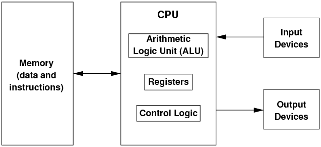
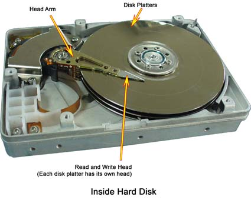

#AQA CS AS Notes

##3.7 Fundamentals of Computer Organisation and Architecture

**[Bourne to Code Link](https://bournetocode.com/projects/AQA_AS_Theory/pages/3-7.html)**

##Internal Hardware Components of a Computer
**Internal Components**
+ These include **CPU**, **components within a CPU**, **main memory**, **buses** and **I/O controllers**.
+ This diagram shows how different components in a computer work together as a functional system:


####Internal Components List
**Processor**
+ The processor is made up of the **control unit**, the **ALU** and several *registers*
+ **The Control Unit**
  + Controls and coordinates all operations
  + It works through a **fetch**, **decode** and **execution** cycle
    + The **fetch** operation fetches the next instruction from the main memory
    + The **decode** operation outputs what the **ALU** needs to perform on the data
    + The **execution** operation causes the instruction to be carried out
  + The **control unit's** role can be summarised as:
    + To **fetch**/**decode**/**execute** instructions
    + To synchronise the operation of the processor
    + To control the operation of the **fetch-execute cycle**
    + To send commands to the other components of the **fetch-execute cycle**
+ **Registers**
  + Registers are small but very fast to hold data before and after being processed by the CPU
  + All **ALU** operartions are accomplished within registers
+ **Arithmetic Logic Unit (ALU)**
  + The **ALU** performs addition, subtraction, multiplication, division, comparison and bitwise operations

**Main Memory**
+ **Memory**
  + Memory is used to hold temporary instructions and data, for manipulation, while the system is running
  + When a block of code or data is held in memory, it's directly accessible by the CPU for manipulation
  + Memory is organised in units called **words**
    + A **word** is the maximum number of bits a CPU can process in a single instruction.
    + The typical **word size** is 8, 16, 32 or 64 bits
    + Each **word** has its own address in the memory

**Buses**
+ Components communicate with each other using buses
+ A bus is **a set of parallel wire connecting different components**
+ the processor is connected to the main memory by three seperate buses, these are the buses:
  + **Address Bus**:
    + **Address Bus** is a pathway or a set of parallel wire that carries the location of the data to be read or written to
    + It is **one directional only** (from processor to the memory or an I/O Controller)
    + The **number of lines** for the address bus **determines the maximum number of bits it can carry**, and in turn **determines the maximum possible memory capacity** of the computer.
      + To understand this, think if the post office only allows 3 digits for house numbers, then the maximum addressable houses will be 999
      + So if a computer has a 32-bit bus, the maximum addressable memory locations will be 2<sup>32</sup>, which is 4GB, asssuming each memory location stores 1 byte of data
  + **Data Bus**:
    + **Data Bus** is a bi-directional pathway or wires that carries data or instructions between computer components
    + The **width of the data-bus** is a key factor in determining the overall computer performance.
    + A typical data bus is 8, 16, 32, or 64 bits wide. 
      + If a computer has a word size of 32 but with a 16 bit data bus, then the data bus had to fetch word twice from the main memory
  + **Control Bus**:
    + **Control Bus** is a bi-directional pathway that carries command, timing and specific status information among components
    + These are some of the control information a control bus may carry:
      + write to memory
      + read from memory
      + write to I/O port
      + read from I/O port
      + request for data bus
      + grant for data bus
      + sync clock
      + reset all components
  + **I/O Controllers**:
    + **An I/O Controller** is a device (an electronic circuit board) that manages the communication between the processor and the I/O device
    + Each I/O device has a seperate controller which connects to the control bus
    + I/O controllers receive input and output requests from the processor, then send device specific control signals to the device
    + I/O controllers manage the data flow from and to the device

####The Von Neumann and Harvard Architectures
+ **Von Neumann Architecture and the Stored Program Concept**
  + Von Neumann invented a machine that would hold the instruction and the data to be processed in one single store, the main memory
    + All computers since have been built on the same principle

  
  
  + In this architecture, the CPU performs the basic computing operations (add, subtract etc.)
  + The CPU gets its data from an external memory, and writes back the results to the memory
  + The memory is also used to hold the program instructions, which control the processing unit and tell it how to manipulate the data
  + The idea of keeping both the data and the instructions in the memory is the essence of the **stored-program architecture**
  + The Von Neumann architecture is used for general purpose  computers
+ **Harvard Architecture**
  + **Physical Separation of Data and Instructions**
  + In this architecture of computers, the data and instructions are stored at two physically different memories. 
    + This separation allows some systems to have a read only instruction memory and read-write for data memory.
    + If a system has more instructions than data, then a wider address bus can be used for the instruction memory and less wide bus for the data memory
  + Harvard architecture can be faster than Von Neumann architecture because data and instructions can be fetched simultaneously
  + Embedded systems such as digital signal processing (DSP) systems use Harvard architecture processors extensively
    + In embedded systems, instructions may be held in read-only memory while data are held in read-write memory
  

##Structure and Role of the Processor and its Components
####The Processor and its Components
**The Role and Operation of a Processor and its Major Components**
+ **Arithemtic Logic Unit**: A circuit inside a CPU performs the following functions:
  + ADD, SUBTRACT, MULTIPLY, DIVIDE
  + Arithmetic (signed bit patterns) and logic shift (unsigned bit patterns) on instructions within a register
  + Performs logical operations such as AND, XOR, OR, NOT
+ **Control Unit**:
  + It **controls and coordinates the activities within the CPU** and **controls the flow of data in and out of CPU**
  + It **takes and instruction and decodes it into opcode and operands**
  + It **manages the execution of the decode instructions**. **fetches data from location** and **stores the results in memory or registers**
+ **Clock**:
  + The syetem clock is used to **synchronise CPU operations**
  + It **generates a series of signals of alternating 0s and 1s**
  + The **CPU takes at least once cycle of time (from 0 to 1 or from 1 to 0) to perform one instruction**
+ **General-Purpose Registers**:
  + **Registers** are very fast and small memory inside the CPU to hold data before, during and after being processed by the CPU
  + Typically, a CPU can have up to 16 registers
  + Some CPUs only have one general purpose register, called an **accumulator**
+ **Dedicated Registers**:
  + **Program Counter (PC)**: A special purpose register that holds the address of the next instruction
  + **Current Instruction Register (CIR or IR)**: Holds the currently being executed instruction
  + **Memory Address Register (MAR)**: Holds the memory address of an instruction to be fetched or written to
  + **Memory Buffer Register (MBR)**: A.K.A. Memory Data Register (MDR), holds the data fetched from or written to memory
  + **Status Register (SR)**: Holds the bits to indicate the results of the execution of an instruction. such as overflow, negative, zero or carry over
+ A diagram look at a processor:


##The Fetch-Execute Cycle and the Role of Registers Within it 
+ When an instruction of a program is being processed by the CPU, it goes through this cycle:
  + **Fetching**
    + Retrieves a program instruction from its memory
  + **Decoding**
    + Determines what actions the instruction requires
  + **Executing**
    + Carries out the decoded actions
+ **Registers' Roles** in the fetch-decode-execute cycle are illustrated in the flowchart:


+ **Fetch**:
  + Contents of the PC transferred to **MAR**
  + Address bus used to transfer this address to main memory
  + Contents of addressed memory location moved into the **MBR** by the data bus increment PC
+ **Decode**:
  + Decode instruction held by the CIR by the control unit
  + Instruction split into opcode and operand
+ **Execute**:
  + Data is fetched (if it's necessary)
  + The opcode identifies the instruction to execute
  + Execute instruction by the relevant part of the processor
  + Result is stored in the accumulator

##The Stored Program Concept
+ **The Stored Program Concept** has the following properties:
  + A machine has the instructions and data being held in the same memory
  + Machine code instructions stored in main memory are fetched, decoded and executed by a processor one at a time

**The Processor Instruction Set**
+ **Processor Instruction Set** means **all the instructions supported by its hardware**
+ Different processors have different instructions sets (**instruction sets are processor specific**)
+ A typical instruction set includes the following common operations:
  + **Data handling and memory operations** - LOAD, STORE
  + **Arithmetic operations** - ADD, SUBTRACT, DIVIDE, MULTIPLY etc.
  + **Comparison operations** - >, <, = etc.
  + **Logical operations** - AND, OR, XOR, NOR, NOT etc.
  + **Control flow operations** - conditional or unconditional
  + **Logical shifts**
  + **Halt**
+ **Instructions consist of an opcode and one or more operands** (value, memory address or register)
  + Machine instruction is made of two parts:
    + **opcode**: the operation to be performed, and a 2-bit code indicate **addressing mode** used for the operation
    + **operands**: the value, memory address or register to be operated on

##Addressing Modes
+ **Immediate Addressing**:
  + The **operand is the actual value** to be operated on
+ **Direct Addressing**:
  + The **operand holds the memory address of the value** to be operated on
```
Suppose that the opcode 010 means LOAD and the addressing mode 1 indicates direct addressing.
Describe the operation that will be performed by the following machine code instruction:
0101 1100

The above instruction means: LOAD the value from the memory location at 12, because: 
      010 -------------------->  1 --------------------> 1100
The opcode for LOAD     The addressing mode     The memory location
```

##Machine Code / Assembly Language Operations
+ **First Generation Languages**:
  + Example: Machine Code
  + **Machine dependent and made of 0s and 1s**
  + Machine code is **very difficult to read and debug**
+ **Second Generation Languages**:
  + Examples: Assembly Code / Assembly Language
  + **Machine Dependent**
  + Assembly code **uses mnemonics** (aimed to helping you remember) to represent the operation codes and addresses
  + **Assembler translates assembly code into machine code**
  + **mnemonics examples**: LDR, STR, ADD, SUB, MOV, CMP
+ **Third Generation Languages**:
  + Examples: High level programming languages like Python, Java, C Family etc.
  + They **have a high level of seperation from the hardware** (less dependent on the types of hardware)
  + They are **easier for programmers to solve problems and debug**
  + They are **closer to human langauge**

**Assembly Language Operations**
+ Understand and apply the basic machine-code operations of:
  + load
  + add
  + subtract
  + store
  + branching (conditional and unconditional)
  + compare
  + logical bitwise operators (AND, OR, NOT, XOR)
  + logical
  + shift right
  + shift left
  + halt

+ Examples of using assembly code:#
  + 1 - Add 12 to the number stored in memory location 52 and save the result in memory location 53:
  ```
  LDR R0, 52          | load the contents of location 52 into register 0
  ADD R1, R0, #12     | add 12 to register 0 and store result in register 1
  STR R0, 53          | store the result in memory location 53
  ```
  + 2 - Brancing operation 1:
  ```
  CMP R1, 40   | Compare value in memory location 40 with value in R1
  BGT .next    | if R1 value is greater, go to label .next 

.next   HALT   | label .next which just halts
  ```
  + 3 - Branching operation 2:
  ```
  CMP R1, #100   | Compare number 100 with value in R1
  BNE .loop1     | if they are not equal, go to label .loop1
  ```
  + 4 - Write assembly code for pseudo-code:
  ```
  pseudo-code:
    X <—- 0
    repeat
     X<—-X + 1
    until X = 99

    CMP R1, #100   | Compare number 100 with value in R1
    BNE .loop1     | if they are not equal, go to label .loop1
  ```

##Factors Affecting Processor Performance
+ **Multiple Cores**:
  + Multiple processors **can carry out tasks in parallel**
  + A task can also **split up to be run on different cores in parallel to speed up execution**
+ **Cache Memory**:
  + These are **small but very fast memory which are located close to the CPU**. 
  + Next instructions or data are stored to be quickly used by the CPU to speed up the executuion
  + Depending on how close those cache memories to the CPU, they can be classified as level 1, 2, 3 etc.
+ **Clock Speed**
  + By increasing the clock speed the processor will **execute more intructions per unit of time**
+ **Word Length**:
  + The larger the word length, **the more data the CPU can process**
  + By increasing the word length, the processor **can access a larger amount of memory through direct addressing**
  + By increasing the word length, the processor could **have a larger instruction set**
+ **Address Bus Width**:
  + By increasing the address bus size we can **address more unique memory locations**
  + Increasing the address bus size **increases the maximum potential memory size**
+ **Data Bus Width**:
  + By increasing the data bus size we can **move more data around per unit of time**

##Input and Output Devices
####BARCODE READER
**===================================================================================**
+ **Barcode**:
  + Barcodes appear on all products you buy, and they are scanned at the checkout point
  + Barcodes are used to keep track of anything accurately
  + There are two types of barcode:
    + **Linear Barcode** (1D): these have vertical stripes of various thickness
    + **2D Barcode**: the quick response (QR) code can hold more information than a linear barcode
      + These are normally found on train tickets, flight tickets and concert tickets
      + Smartphones have apps to allow users to scan QR codes to take them to a website or other information
+ **Barcode Reader (4 types)**:
+ **Laser Scanner**:
  + Often seen in supermarket checkout counters
  + They user laser beams as the light source to digitise the code
  + The intensity of the light is reflected back from the light source and generates a waveform that is used to measure the widths of the bars and spaces in the barcode.
    + Dark bars in the barcode absorb light and white spaces reflect light so that the voltage waveform generated is an exact duplicate of the bar and space pattern in the barcode
    + This waveform is decoded by the scanner in a manner similar to the way Morse code dots and dashes are decoded


+ **Camera-Based Readers**:
  + Camera based readers use a small video camera to capture an image of a barcode.
  + The reader then uses sophisticated digital image processing techniques to decode the barcode.
+ **Charge-Couple Devices (CCD) Readers**:
  + CCD (Charge Coupled Device) readers use an array of hundreds of tiny light sensors lined up in a row in the head of the reader.
    + Each sensor measures the intensity of the light immediately in front of it
  + The important difference between CCD reader and a pen or laser scanner is that the CCD reader is measuring emitted ambient light from the barcode whereas pen or laser scanners are measuring reflected light of a specific frequency originating from the scanner itself
  + Similar to digital cameras they capture an image of the barcode
  + They generally have very fast scan rates but limited read ranges (less than 3 inches) compared to a laser or image scanners
+ **Pen-Type Readers**:
  + Pen type readers consist of a light source and a photo diode that are placed next to each other in the tip of a pen or wand
  + To read a barcode, you drag the tip of the pen across all the bars in a steady even motion
  + The photo diode measures the intensity of the light reflected back from the light source and generates a waveform that is used to measure the widths of the bards and spaces in the barcode


####DIGITAL CAMERA
**===================================================================================**
+ Digital cameras use a grid of tiny light sensors to measure the amount of light passing through the lens when the shutters are open
  + Each sensor measures the colour and brightness of each pixel
  + Each sensor turns the light into electricity and the amount of charge is stored as binary data
  + The binary data are then recorded onto the camera's memory card
  + Images can then be produced using appropriate image software
+ A digital camera uses 2 types of sensors:
+ **CCD (Couple Charged Device)**:
  + A CCD **transports the charge across the chip and reads it at one corner of the array**
  + An **analog-to-digital converter (ADC) then turns each pixel's value into a digital value by measuring the amount of charge at each photosite and converting that measurement into binary form**
+ **CMOS (Complementary Metal Oxide Semiconductor)**:
  + CMOS devices **use several transistors at each pixel to amplify and move the charge using more traditional wires**
+ **CCD sensors produce higher quality images but consumes up to 100s more power than a CMOS sensor**

####LASER PRINTER
**===================================================================================**
+ A laser printer uses powdered ink, called toner
+ A computer sends data to be printed to a laser printer and the laser printer's onboard circuit works out how to print the data
+ The printer generates a bitmap of the data
+ A photoreceptor drum is given a positive charge spread uniformly across its surface
  + The circuit activates the laser to make it draw the image of the page onto the drum
  + The laser beam doesn't actually move, it bounces off a moving mirror that scans it over the drum.
  + Where the laser beam hits the drum, it erases the positive charge that was there and creates an area of negative charge instead
  + Gradually, an image of the entire page builds up on the drum
    + Where the page should be white, there are areas with a positive charge
    + Where the drum should be black, there are areas with a negative charge
+ An ink roller touching the photoreceptor drum coats it with tiny particles of powdered ink (toner)
  + The toner has been given a positive electrical charge, so it stick to the parts of the photoreceptor drum that have a negative charge
+ A sheet of paper from a hopper on the other side of the printer feeds up toward the drum
  + As it moves along, the paper is given a strong positive electrical charge
+ When the paper moves near the drum, its positive charge attracts the negatively charged toner particles away from the drum
  + The image is transferred from the drum onto the paper but, for the moment, the toner particles are just resting lightly on the paper's surface
+ The ink paper passes through two hoter rollers (the fuser unit).
  + The heat and pressure from the rollers fuse the toner particles permanently into the fibers of the paper
+ Laser printer is best suited for text printing
  + For photo realistic printing it's best to use inkjet printers

####RFID
**===================================================================================**
+ **RFID (Radio Frequency Identification**):
  + Used for **tracking animals, bank cards, passports** and other products
  + It can be **read remotely**, up to **300 metres away**
  + RFID **contains a tiny microchip transponder and antena**
  + **Very small in size**, therefore can be **implanted in animals**
+ **Cases of RFID Being Used**:
  + **Libraries**:
    1. The RFID inside books contain a chip that holds the information about the book
    2. An antenna that picks up power from a signal sent out by a reader, as the walk in or out the library
    3. The transponder spends the data on the chip to the reader
    4. The reader may set the anti-theft bit depending on if books are being returned or checked out
  + **Contactless Bank Card**:
    1. The card's RFID contains a chip that holds your account information
    2. An antenna that picks up power from a signal sent out by the card reader
    3. The transponder sends your data to the reader

##Secondary Storage Devices
**Primary Storage**
+ The primary store for a computer is RAM.
+ RAM is a volatile storage, so when the power is off, all data in the RAM is gone
**Secondary Storage**
+ Secondary storage is the storage not directly accessible to the computer's CPU
+ Secondary Storage is permenant, or non-volatile
+ It's slower than RAM
+ Examples: Internal hard-disk (HDD), optical media and solid state disk (SSD)

####HARD DISK
**===================================================================================**



+ Hard disk is **made of platters of discs coated in magnetic material**, normally iron particles
  + Those **particles are magnetised to be in a north or south polarity**
    + Those **polarities of those particles represent 0 or 1**
+ Each **disc is divided into concentric circles**, called **tracks**
+ Each **track is then sub-divided into sectors**
+ The **disk is spinning at a very high speed**, up to 10,000RPM
+ **Multiple moving arms with read/write heads** ```(drive head)``` **are being moved into different tracks and sectors to read or write data**
+ **Each platter has its own drive head**


####OPTICAL DISK
**===================================================================================**


+ CD ROMs, DVDs, Blue-Ray Disk are all forms of optical disks
+ Optical disk encodes data by lands and pits
  + Those pits are created by using a high power laser to burn off the reflective top layer
+ When read from an optical disk, a low power laser is used to shine on the disk
  + Lands are reflective, therefore, light bounces back and is registered as 1
  + Pits are less reflective and when light shines on them, the light diffuses, therefore, it's registered as a 0
+ Optical disk has only one spiral track
+ Re-writable disks use a special material which can change its state between amorphous and crystaline
+ Sizes:
  + Typical CD can hold 650MB
  + Typical DVD can hold 4.7GB
  + Typical Blue-Ray can hold 50GB
  + The physical sizes of the above disks are very much the same
  + The storage capacity variation is achieved by using a shorter wave length laser to create finer/smaller lands and pits
+ **Typical Applications of Optical Disks**:
+ They are easy to produce
+ Can be used to store music, movies and photos
+ Easy to send by post for distribution
+ They can be easily damaged by sunlight or heat and easily scratched

##SOLID-STATE DISK (SSD)
+ SSD consists of millions of NAND flash memory cells and a controller that manages pages, and blocks and complexities of writing
+ Based on floating gate transistors that trap and store charge
+ Each cell is a floating gate transistor/NAND flash memory cell
+ A typical flash memory grid has 32 to 256 columns (bit lines) and 4,096 to 65,536 rows (word lines)
  + The total grid is called a block, and each row is called a page (in practice, the pages are a little larger still, to include error-correction and bookkeeping data).


+ Each cell changes its state between charge and no charge by delivering a current along the bit and word lines to activate the flow of electrons from the source towards the drain


+ The current on the word line is strong enough to force a few electrons across an insulated oxide layer into a floating gate
  + Once the current is off, those electrons are trapped inside the floating gate
+ The state of the NAND cell is determined by measuring the charge in the floating gate
  + No charge is 1, some charge is 0
+ Data is stored in page
+ Pages are grouped into blocks
+ NAND flash memory cannot overwrite existing data
+ Old data must be erased before any data can be written to the same location
+ Although data can be written to pages, the technology requires the whole block to be erased
+ Lower latency and faster transfer speeds than a magnetic disk drive

##Comparing the Capacity of Various Media

