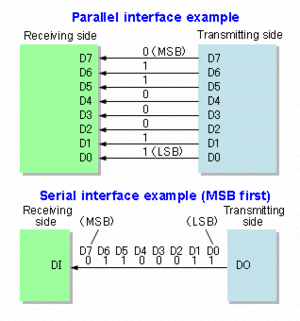

# AQA CS AS Notes

## 3.9 Fundamentals of Communication and Networking

**[Bourne to Code Link](https://bournetocode.com/projects/AQA_AS_Theory/pages/3-9.html)**

## 3.9.1 Communication
## 3.9.1.1 Communication Methods
*Define and compare synchronous and asynchronous data transmission.*

*Describe the purpose of start and stop bits in asynchronous data transmission.*

**Serial and Parallel Data Transmission**
+ Electronic data (0s and 1s) can be transmitted by two different methods:
	+ **Serial Transmission**
		+ Data bits are sent one bit at a time over a single wire.
		+ Used in networks, phones, keyboard and mouse
		+ **ADVANTAGES:**
			+ Cheaper than **parallel** because:
				+ Less wires needed
				+ Much less complex
				+ Smaller transmitting size
				+ Less receiving interfaces
			+ More reliable over long distance without suffering from "skew"
			+ Can transmit data at a higher frequency (higher bit rate) without suffering "crosstalk"

	+ **Parellel Transmission**
		+ Data bits are sent at the same time over multiple wires.
		+ Used by buses inside a computer, printers can be connected via parallel cables with a limited distance
		+ **ADVANTAGES:**
			+ Faster than **serial** but only works well over short distances (i.e. several meters)
		+ **DISADVANTAGES:**
			+ Can suffer from "skew" due to slightly different properties in each parallel wire, which could result in different bits travelling at different speeds
			+ A signal transmitted on one wire could create an underised effect in another wire, resulting in the phenemenon called "crosstalk".
				+ More prominent with higher frequencies

	

## 3.9.1.2 Communication Basics
**Bit Rate**
+ The number of bits that can be transmitted serially per second

**Baud Rate**
+ The number of symbols/signals transferred per second.
+ A symbol/signal may encode more than 1 bit
	+ E.g. Using 4 different frequencies, 4 different 2-bit patterns can be encoded with each frequency which are: 00, 01, 10 or 11
+ This is called symbol rate
+ Since 1 symbol can have more than 1 bit, **bit rate** will be higher than **baud rate**
+ In the case of baud rate:
``` 
bit rate = (baud rate) x (number of bits per symbol)
``` 

**Bandwidth**
+ The amount of data that can be transmitted from one point to another in a given period of time (usually a second)
+ It's expressed in bits per second (bps)
	+ Modern networks usually have speeds measured in megabits per second (mbps) or gigabits per second (gbps)

**Latency**
+ Latency is the delay from the start of the transmission to the time the data transmitted arrives at the destination
+ Latency is the wait time from the signal travelling over geographical distances and various pieces of communication equipment
+ Even fiber optics are limited by more than just the speed of light, as the refractive index of the cable and all repeaters or amplifiers along their length introduce delays

**Protocol**
+ A set of standardised rules used for governing communications between devices.
	+ Standardised rules allow communication between different devices possible
+ These rules include:
	+ Speed
	+ Data format
	+ Error detection an correction
	+ Mode of transmission
	+ Physical connections/cabling

## 3.9.2 Networking
#### 3.9.2.1 Network topology
+ Understand:
	+ physical star topology
	+ logical bus network topology
	+ differentiate between them
	+ explain their operation
	+ compare each (advantages and disadvantages).

A network physically wired in star topology can behave logically as a bus network by using a bus protocol and appropriate physical switching.

#### 3.9.2.2 Types of networking between hosts
+ Explain the following and describe situations where they might be used:
	+ peer-to-peer networking
	+ client-server networking.

In a peer-to-peer network, each computer has equal status. In a client-server network, most computers are nominated as clients and one or more as servers. The clients request services from the servers, which provide these services, for example file server, email server.

#### 3.9.2.3 Wireless networking
+ Explain the purpose of WiFi.

A wireless local area network that is based on
international standards.

Used to enable devices to connect to a network
wirelessly.


+ Be familiar with the components required for wireless networking.
	+ wireless adapter
	+ wireless access point


+ Be familiar with how wireless networks are secured.

Strong encryption of transmitted data using WPA (WiFi Protected Access)/WPA2, SSID (Service Set Identifier) broadcast disabled, MAC (Media Access Control) address white list.

+ Explain the wireless protocol Carrier Sense Multiple Access with Collision Avoidance (CSMA/ CA) with and without Request to Send/Clear to Send (RTS/CTS).

+ Be familiar with the purpose of Service Set Identifier (SSID).


	
