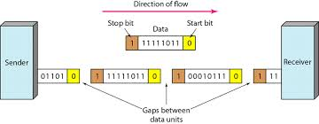

# AQA CS AS Notes

## 3.9 Fundamentals of Communication and Networking

**[Bourne to Code Link](https://bournetocode.com/projects/AQA_AS_Theory/pages/3-9.html)**

##Communication
##Communication Methods
####Serial and Parallel Data Transmission
+ Electronic data (0s and 1s) can be transmitted by two different methods:
	+ **Serial Transmission**
		+ Data bits are sent one bit at a time over a single wire.
		+ Used in networks, phones, keyboard and mouse
		+ **ADVANTAGES:**
			+ Cheaper than **parallel** because:
				+ Less wires needed
				+ Much less complex
				+ Smaller transmitting size
				+ Less receiving interfaces
			+ More reliable over long distance without suffering from "skew"
			+ Can transmit data at a higher frequency (higher bit rate) without suffering "crosstalk"

	+ **Parellel Transmission**
		+ Data bits are sent at the same time over multiple wires.
		+ Used by buses inside a computer, printers can be connected via parallel cables with a limited distance
		+ **ADVANTAGES:**
			+ Faster than **serial** but only works well over short distances (i.e. several meters)
		+ **DISADVANTAGES:**
			+ Can suffer from "skew" due to slightly different properties in each parallel wire, which could result in different bits travelling at different speeds
			+ A signal transmitted on one wire could create an underised effect in another wire, resulting in the phenemenon called "crosstalk".
				+ More prominent with higher frequencies

	

##Communication Basics
**Bit Rate**
+ The number of bits that can be transmitted serially per second

**Baud Rate**
+ The number of symbols/signals transferred per second.
+ A symbol/signal may encode more than 1 bit
	+ E.g. Using 4 different frequencies, 4 different 2-bit patterns can be encoded with each frequency which are: 00, 01, 10 or 11
+ This is called symbol rate
+ Since 1 symbol can have more than 1 bit, **bit rate** will be higher than **baud rate**
+ In the case of baud rate:
``` 
bit rate = (baud rate) x (number of bits per symbol)
``` 

**Bandwidth**
+ The amount of data that can be transmitted from one point to another in a given period of time (usually a second)
+ It's expressed in bits per second (bps)
	+ Modern networks usually have speeds measured in megabits per second (mbps) or gigabits per second (gbps)

**Latency**
+ Latency is the delay from the start of the transmission to the time the data transmitted arrives at the destination
+ Latency is the wait time from the signal travelling over geographical distances and various pieces of communication equipment
+ Even fiber optics are limited by more than just the speed of light, as the refractive index of the cable and all repeaters or amplifiers along their length introduce delays

**Protocol**
+ A set of standardised rules used for governing communications between devices.
	+ Standardised rules allow communication between different devices possible
+ These rules include:
	+ Speed
	+ Data format
	+ Error detection an correction
	+ Mode of transmission
	+ Physical connections/cabling

####Synchronous and Asynchronous Transmission Modes
**Synchronous Transmission**


+ A process where data is transferred in regular intervals that are timed by a clocking signal
+ It allows for a constant and reliable transmission for time-sensitive data, such as real-time video or voice
+ Parallel transmission typically uses synchronous transmission

**Asynchronous Transmission**



+ Signals are sent in an agreed pattern of bits and if both ends are agreed on the pattern then communication can take place
+ Bits are grouped together and consist of both data and control bits
+ If the signal is not synchronised the receiver will not be able to distinguish when the next group of bits will arrive. To overcome this the data is preceded by a start bit, usually binary 0, the byte is then sent and a stop bit or bits are added to the end
+ In addition to the control data, small gaps are inserted between each chunk to distinguish each group
	+ Each bit remains timed in the usual way, therefore, at bit level the transmission is still synchronous (timed)
+ Asynchronous transmission is relatively slow due to the increased number of bits and gaps
+ It is a cheap and effective form of serial transmission and is particularly suited for low speed connections such as keyboard and mouse

##Networking
####Network Topology
**Network Basics**
+ Computers can be connected in different layouts by cables to form a network
+ LAN or local area network interconnects computers within a limited area such as a residence, school, laboratory, or office buildings
+ LAN is contrasted in principle to a wide area network (WAN), which covers a larger geographic distance and may involve leased telecommunication circuits, while the media for LANs are locally managed
+ All devices on a network must have a network interface card (NIC) to be able to communicate with other devices
+ Each NIC has a factory assigned unique code, MAC address (Media Access Control Address)
	+ MAC address is also called physical address
+ MAC address is 48 bits long and is written in 12 hex digits, such as 32:00:1a:d2:2c:80
+ When a device wants to join an existing network, it broadcasts its MAC address

**Bus Topology**
+ In this topology/layout, all devices (nodes) are connected to a single cable (the backbone cable)
+ The ends of the cable are connected to a device or a terminator


+ When a node needs to transmit data, it broadcasts to every other nodes, but only the intended receipient accepts and processes the message
+ The traffic generated by each node has equal tansmission priority
+ In order for nodes to transmit on the same buus simultaneously, they use a media access control technology such as Carrier Sense Multiple Access (CSMA) or a bus master
+ If two nodes try to transmit at the same time, a carrier sensing detects the other signals, and both nodes then wait for a random amount of time before re-transmit
+ **ADVANTAGES**:
	+ Inexpensive to set up, it does not require as much cabling as a star topology and no need for a central node such as a hib or switch
	+ Adding additional nodes is easy without interrupting the network
	+ It works well for small networks
+ **DISADVANTAGES**:
	+ Entire network shuts down if there is a break in the main cable
	+ Low security as all nodes can see all data transmitted
	+ Terminators are required at both ends of the backbone cable
	+ Network slowness increases wehn more devices are added into the network
	+ Difficult to identify the problem if the entire network shuts down

**Star Network Topology**
+ In a star network, each node connects to a central device which can be a hub or a switch
+ A node sends data to a hub, and then the hub broadcasts the message to all other nodes
+ A switch keeps a record of the MAC address (Media Access Control Address) of each node on its network
	+ It sends the data received to the intended node


+ **ADVANTAGES**:
	+ Star networks are very reliable because if one computer or its connection breaks it doesn't affect the other computers and their connections
	+ Easy to add a node without interrupting other nodes
	+ Secure as each node sends data directly to the central node
	+ Each node can have a different speed
	+ With more nodes added, the overall performance will not be affected significantly
+ **DISADVANTAGES**:
	+ More expensive as more cabling needed and also a central device is needed
	+ If the central node fails, no communication is possible for the whole network

#### 3.9.2.2 Types of networking between hosts
+ Explain the following and describe situations where they might be used:
	+ peer-to-peer networking
	+ client-server networking.

In a peer-to-peer network, each computer has equal status. In a client-server network, most computers are nominated as clients and one or more as servers. The clients request services from the servers, which provide these services, for example file server, email server.

#### 3.9.2.3 Wireless networking
+ Explain the purpose of WiFi.

A wireless local area network that is based on
international standards.

Used to enable devices to connect to a network
wirelessly.


+ Be familiar with the components required for wireless networking.
	+ wireless adapter
	+ wireless access point


+ Be familiar with how wireless networks are secured.

Strong encryption of transmitted data using WPA (WiFi Protected Access)/WPA2, SSID (Service Set Identifier) broadcast disabled, MAC (Media Access Control) address white list.

+ Explain the wireless protocol Carrier Sense Multiple Access with Collision Avoidance (CSMA/ CA) with and without Request to Send/Clear to Send (RTS/CTS).

+ Be familiar with the purpose of Service Set Identifier (SSID).


	
