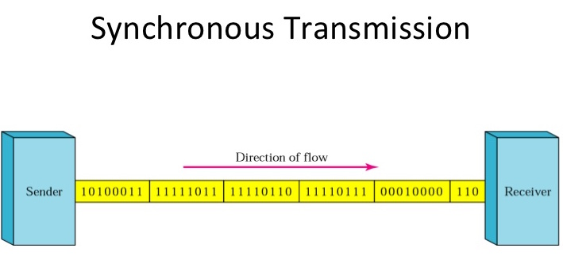
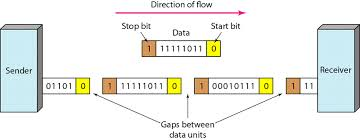
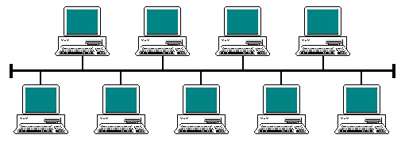
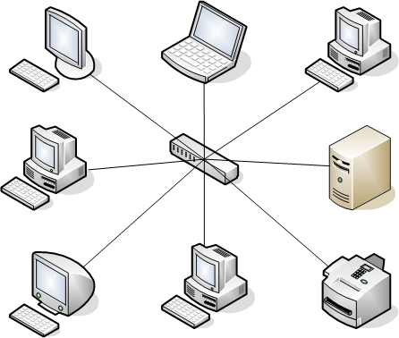

# AQA CS A-Level Notes

## 4.9 Fundamentals of Communication and Networking

**[Bourne to Code Link](https://bournetocode.com/projects/AQA_AS_Theory/pages/3-9.html)**

# 4.9.1 Communication
## 1. Communication Methods
**Serial and Parallel Data Transmission**
+ Electronic data (0s and 1s) can be transmitted by two different methods:
	+ **Serial Transmission**
		+ Data bits are sent one bit at a time over a single wire.
		+ Used in networks, phones, keyboard and mouse
		+ **ADVANTAGES:**
			+ Cheaper than **parallel** because:
				+ Less wires needed
				+ Much less complex
				+ Smaller transmitting size
				+ Less receiving interfaces
			+ More reliable over long distance without suffering from "skew"
			+ Can transmit data at a higher frequency (higher bit rate) without suffering "crosstalk"

	+ **Parellel Transmission**
		+ Data bits are sent at the same time over multiple wires.
		+ Used by buses inside a computer, printers can be connected via parallel cables with a limited distance
		+ **ADVANTAGES:**
			+ Faster than **serial** but only works well over short distances (i.e. several meters)
		+ **DISADVANTAGES:**
			+ Can suffer from "skew" due to slightly different properties in each parallel wire, which could result in different bits travelling at different speeds
			+ A signal transmitted on one wire could create an underised effect in another wire, resulting in the phenemenon called "crosstalk".
				+ More prominent with higher frequencies

	

## 2. Communication Basics
**Bit Rate**
+ The number of bits that can be transmitted serially per second

**Baud Rate**
+ The number of symbols/signals transferred per second.
+ A symbol/signal may encode more than 1 bit
	+ E.g. Using 4 different frequencies, 4 different 2-bit patterns can be encoded with each frequency which are: 00, 01, 10 or 11
+ This is called symbol rate
+ Since 1 symbol can have more than 1 bit, **bit rate** will be higher than **baud rate**
+ In the case of baud rate:
``` 
bit rate = (baud rate) x (number of bits per symbol)
``` 

**Bandwidth**
+ The amount of data that can be transmitted from one point to another in a given period of time (usually a second)
+ It's expressed in bits per second (bps)
	+ Modern networks usually have speeds measured in megabits per second (mbps) or gigabits per second (gbps)

**Latency**
+ Latency is the delay from the start of the transmission to the time the data transmitted arrives at the destination
+ Latency is the wait time from the signal travelling over geographical distances and various pieces of communication equipment
+ Even fiber optics are limited by more than just the speed of light, as the refractive index of the cable and all repeaters or amplifiers along their length introduce delays

**Protocol**
+ A set of standardised rules used for governing communications between devices.
	+ Standardised rules allow communication between different devices possible
+ These rules include:
	+ Speed
	+ Data format
	+ Error detection an correction
	+ Mode of transmission
	+ Physical connections/cabling

### Synchronous and Asynchronous Transmission Modes
**Synchronous Transmission**



+ A process where data is transferred in regular intervals that are timed by a clocking signal
+ It allows for a constant and reliable transmission for time-sensitive data, such as real-time video or voice
+ Parallel transmission typically uses synchronous transmission

**Asynchronous Transmission**



+ Signals are sent in an agreed pattern of bits and if both ends are agreed on the pattern then communication can take place
+ Bits are grouped together and consist of both data and control bits
+ If the signal is not synchronised the receiver will not be able to distinguish when the next group of bits will arrive. To overcome this the data is preceded by a start bit, usually binary 0, the byte is then sent and a stop bit or bits are added to the end
+ In addition to the control data, small gaps are inserted between each chunk to distinguish each group
	+ Each bit remains timed in the usual way, therefore, at bit level the transmission is still synchronous (timed)
+ Asynchronous transmission is relatively slow due to the increased number of bits and gaps
+ It is a cheap and effective form of serial transmission and is particularly suited for low speed connections such as keyboard and mouse

# 4.9.2 Networking
## 1. Network Topology
**Network Basics**
+ Computers can be connected in different layouts by cables to form a network
+ LAN or local area network interconnects computers within a limited area such as a residence, school, laboratory, or office buildings
+ LAN is contrasted in principle to a wide area network (WAN), which covers a larger geographic distance and may involve leased telecommunication circuits, while the media for LANs are locally managed
+ All devices on a network must have a network interface card (NIC) to be able to communicate with other devices
+ Each NIC has a factory assigned unique code, MAC address (Media Access Control Address)
	+ MAC address is also called physical address
+ MAC address is 48 bits long and is written in 12 hex digits, such as 32:00:1a:d2:2c:80
+ When a device wants to join an existing network, it broadcasts its MAC address

**Bus Topology**
+ In this topology/layout, all devices (nodes) are connected to a single cable (the backbone cable)
+ The ends of the cable are connected to a device or a terminator



+ When a node needs to transmit data, it broadcasts to every other nodes, but only the intended receipient accepts and processes the message
+ The traffic generated by each node has equal tansmission priority
+ In order for nodes to transmit on the same buus simultaneously, they use a media access control technology such as Carrier Sense Multiple Access (CSMA) or a bus master
+ If two nodes try to transmit at the same time, a carrier sensing detects the other signals, and both nodes then wait for a random amount of time before re-transmit
+ **ADVANTAGES**:
	+ Inexpensive to set up, it does not require as much cabling as a star topology and no need for a central node such as a hib or switch
	+ Adding additional nodes is easy without interrupting the network
	+ It works well for small networks
+ **DISADVANTAGES**:
	+ Entire network shuts down if there is a break in the main cable
	+ Low security as all nodes can see all data transmitted
	+ Terminators are required at both ends of the backbone cable
	+ Network slowness increases wehn more devices are added into the network
	+ Difficult to identify the problem if the entire network shuts down

**Star Network Topology**
+ In a star network, each node connects to a central device which can be a hub or a switch
+ A node sends data to a hub, and then the hub broadcasts the message to all other nodes
+ A switch keeps a record of the MAC address (Media Access Control Address) of each node on its network
	+ It sends the data received to the intended node



+ **ADVANTAGES**:
	+ Star networks are very reliable because if one computer or its connection breaks it doesn't affect the other computers and their connections
	+ Easy to add a node without interrupting other nodes
	+ Secure as each node sends data directly to the central node
	+ Each node can have a different speed
	+ With more nodes added, the overall performance will not be affected significantly
+ **DISADVANTAGES**:
	+ More expensive as more cabling needed and also a central device is needed
	+ If the central node fails, no communication is possible for the whole network

**Physical and Logical Topology**
+ A **Physical Topology** is how devices are actually interconnected with wires and cables.
+ For example: in a star network that uses hubs rather than switches, the logical topology appears as if every node is connected to a common bus that runs from node to node
	+ However, its physical topology is a star in which every node on the network connects to a central hub
+ A **Logical Topology** is how devices appear connected to the user

## 2. Types of Networking Between Hosts
**Peer-to-Peer (P2P) Network**
+ A network of personal computers, each of which acts as both client and server, so that each can exchange files and email directly with every other computer on the network
+ Each computer can access any of the others, although access can be restricted to those files that a computer's user chooses to make available
+ Each computer has equal status
+ **ADVANTAGES**:
	+ Easy and cheap to set up and easy to maintain
	+ Allows users to share resources such as a printer or a router
	+ There is no central server to setup or maintain
+ **DISADVANTAGES**:
	+ Malware, spyware and viruses can be easily transmitted
	+ Each computer will have to have its own back-up system if at all
	+ Can be used for piracy purposes
	+ Network reliability is difficult to determine

**Client-Server Network**
+ A computer network in which one centralized, powerful computer (called the server) is a hub to which many less powerful personal computers or workstations (called clients) are connected
+ Most computers are nominated as clients and one or more as servers
+ The clients run programs and acces data that is stored on the server
+ In a network, there may be many servers, such as a web server, mail server, database server, directory server, file server and printer server
+ **ADVANTAGES**:
	+ Better security due to a centrally managed server which is easy to deplore security measures such as secure connections and access control
	+ Data and hardware resources can be shared
	+ If regularly backed and a good restore is in place, data loss and down time is kept to a minimum
+ **DISADVANTAGES**:
	+ It is expensive to set up initially
	+ Dedicated server admin needed to manage the server(s) and the network

## 3. Wireless Networking
### Wireless Network Basics
**Wireless Networking Basics**
+ A wireless network uses radio waves, just like cell phones, televisions and radios do
+ In fact, communication across a wireless network is a lot like two-way radio communication.
+ Here's what happens:
	+ A computer's wireless adapter translates data into a radio signal and transmits it using an antenna
	+ A wireless router receives the signal and decodes it, the router sends the information to the internet using a physical, wired Ethernet conenction
+ The process also works in reverse, with the router receiving information from the internet, translating it into a radio signal and sending it to the computer's wireless adapter
+ A **WiFi Hotspot** is simply an area with an accessible wireless network
	+ The term is most often used to refer to wireless networks in public areas like airports and coffee shops

**Purpose of WiFi**
+ WiFi is a wireless technology that enables a device such as a PC, laptop, smartphone, tablet, printer or media player to connect to a network via a wirless access point (WAP) so they can access or share network resources
+ A typical WAP can have a range of 90 metres outdoors and 50 metres indoors
	+ The range is affected by many other factors

**Components Required For Wireless Networking**
+ A device needs a wireless network interface controller (could be a USB or PCI card)
+ A device with a wireless network interface controller is called a station
+ All stations in the WAP range will listen to one radio frequency transmission
+ A WAP can connect to a router or be an intergral part of a router
+ The WAP tries to process all transmissions from all stations in its range as fast as it can
	+ Only one station can transmit data at a time
	+ The more stations it has, the slower the communication becomes

### WiFi Security
**Wireless Network Security**
+ When you are trying to join a new WiFi network, if it is secured (password protected), you will be asked to choose either WPA and/or WPA2 secure scheme
+ WPA (WiFi protected access) and WPA2 (the newer generation set to replace WPA) are two security protocols developed by the WiFi alliance
+ The WPA-Personal is one mode of WPA which is widely used in home and small offices
	+ It does not require a centralised server to work
	+ WPA-Personal works by encrypt communication using a 256-bit key.
	+ The WiFi password you normally use to join a network is part of the 256-bit key
+ WPA-Enterprise is designed for enterprise networks and requires a RADIUS server
	+ This requires a more complicated setup, but provides additional security

**SSID (Service Set Identification)**
+ SSID is the name for a local WiFi network, such as BTHub6-XTJG
+ SSID's purpose is to identify a WiFi network and is also used for part of the encryption key

### CSMA/CA
**CSMA/CA**
+ **Carrier Sense Multiple Access/Collision Avoidance** is a protocol used in wireless transmission to prevent collisions before they occur
+ Before transmission, a station listens for signals on the network to determine if the channel is free or another station is transmitting
	+ If a signal is detected, then it waits for a random amount of time for the other station before it re-listens again
+ Each station may optionally use a **request to send** (from the station)/**clear to send** (from the WAP) (RTS/CTS) after determining there is no station currently transmitting
+ Using RTS/CTS can avoid the problem with hidden stations (those stations whose signals are not visible to the listening station but only to the WAP due to being outside the communication range)


**Location Based WiFi Services**
+ WiFi location can be thought as indoor GPS
+ WiFi based positioning systems are used where GPS is inadequate due (typically) to signal blockage
+ Retail businesses, hospitalities, healthcare and education are looking to use this technology to reach people
+ Examples of LBS:
	+ location based advertisements and coupons
	+ retail centres can optimise store layouts based on typical customer traffic paths
	+ business owners can change more for premium storefront or high-view ad spots
	+ personalise customer services such as personalised greeting and check-in on arrival
	+ hospitals can use LBS for indoor navigation, tracking staff and patients, location-based messaging, assest management, location analytics, and in intergrating with other clinical systems
	+ In a university campus, LBS can provide users with points of interest, such as restaurants, student meeting places, lectures and events, and in campus traffic patterns
	+ The problem of WiFi based indoor localisation of a device consists in determining the position of client devices with repsect to access points
+ Many techniques exist to accomplish this
+ Privacy concerns on how user location data is being used and how longs it's being retained

# 4.9.3 The Internet
## 1. The Internet and How it Works
## 2. Internet Security

# 4.9.4 The Transmission Control Protocol/Internet Protocol (TCP/OP)
## 1. TCP/IP
## 2. Standard Application Layer Protocols
## 3. IP Address Structure
## 4. Subnet Masking
## 5. IP Standards
## 6. Public and Private IP Addresses
## 7. Dynamic Host Configuration Protocol (DHCP)
## 8. Network Address Translation (NAT)
## 9. Port Forwarding
## 10. Client Server Model
## 11. Thin vs Thick Client Programming


