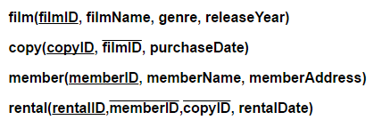
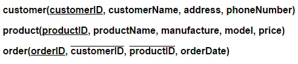

#AQA CS A-Level Notes

# 4.10 Fundamentals of Databases

**[Bourne to Code Link](https://bournetocode.com/projects/AQA_A_Theory/pages/4-10.html)**
# 4.10.1 Conceptual Data Models and Entity Relationship Modelling

# 4.10.2 Relational Databases
+ A **relational database** is a database that has been designed and structured so that the relationships among different entities are identified by shared attributes among different entities.
+ **Relationships** are normally defined by using primary, foreign or/and composite keys.
  + **primary key** is a unique identifier for a record.
  + **foreign key** is a primary key from a different table used to define the relationship.
  + **composite key** is a combination of two or more attributes in a table that can be used to uniquely identify each record in the table.
  + Using the standard notation, the above Goodfilm example entities can be modelled as below:

+ The **primary keys are underlined**, the **foreign keys are overlined**, and the **composite key is both underlined and overlined** (not in this example).

**Different Types of Relationships and Entity Relationship Diagram**
+ A relationship between any two entities may be in one of the three:
  + **One-to-one**: one entity can relate to the other entity exactly once.
    + E.g. the ```copy``` entity can only be related in the ```rental``` entity once
    + In other words, only one unique copy can be rented out by one member, that is, exactly one unique copyID exists in the rental table.
    + This relationship is described using entity relationship diagram by a **single line** between entities.
    
  
  + **One-to-many**: One entity can relate to the other entity more than once
    + E.g. one film can have multiple copies in the copy entity.
    + In other words, one filmID can appear multiple times in the copy table.
    
  + **Many-to-many**: One entity can appear multiple times in the other entity and vice versa.
    + E.g. a customer can buy many types of products and one type of product can be purchased by many customers
    
    + When modelling a many-to-many relationship, an extra table is needed in order to link the customer and the product entities
    
    + This can be expressed in standard notation as:
    

# 4.10.3 Database Normalisation
**Database normalisation** is the process to make a database model more efficient. The purpose of normalisation is to have a database structure in the third normal form
## First Normal Form (1NF)
+ A table is said to be in **first normal form** if:
  + it has no repeating attribute/field or groups of attributes
  + and it only contains atomic values
* Look at the table below. For each record, it has 3 attributes: **name**, **courseEnrolled** and **courseFinishDate**.
  + It's not in first normal form since it contains repeating groups of attributes for the two attributes: **courseEnrolled** and **courseFinishDate**
  
| name | courseEnrolled | courseFinishDate |
|--------|-------------|---------|
| Peter Parker | Maths, Biology | 12/12/2015, 01/08/2016 |
| Mary Jane | Maths, English | 29/04/2015, 21/05/2016 |

* To make the above table in first normal form, we need to make **courseEnrolled** and **courseFinishDate** contain only one/atomic value. To do this, another table, courses, will be needed which should be a different entity anyway:

**course(--courseID--, courseName)**

(-- = underlined)

| courseID | courseName |
|--------|-------------|
| 1 | Maths |
| 2 | Biology |
| 3 | English |

* Then the pupils can be changed to be in first normal form:

| pupilID | name |
|--------|-------------|
| 1 | Peter Parker |
| 2 | Mary Jane |

* A third table will be need to link the pupil and the course table togther

**enrollment(--courseID--, --pupilID--, courseLocation)**

## Second Normal Form (2NF)
+ A table is said to be in **second normal form** if:
  + It is in first normal form
  + and all non-key attributes are fully functional dependent on the primary
  + This is partially dependent on the primary key and only occurs if there's a composite key
+ Look at the table below:

| pupilID | courseID | courseLocation | finishDate |
|--------|-----------|-----------|-----------|
| 1 | 1 | Bourne | |
| 1 | 2 | Peterborough | |

1. The above table has a **composite key** which are the two attributes **pupilID** and **courseID** that have been combined to uniquely identify a record
2. The attribute **courseLocation** is not fully dependent on the composite key (also the primary key). It partially depends on the courseID
3. To make the above table in the second normal form, the courseLocation attribute should be in the course table:

| courseID | courseName | courseLocation |
|--------|-----------|-----------|
| 1 | Maths | Bourne |
| 2 | Biology | Peterborough |
| 3 | English | Stamford |

## Third Normal Form (3NF)
+ A table is said to be in **third normal form** if:
  + It is in the second normal form
  + And there is no non-key dependencies, or no attributes dependent or other attributes
  + **All attributes are dependent on the key, the whole key, and nothing but the key**
  
## Purpose of Database Normalisation
+ To reduce data redundancy
  + this means to avoid the same data being stored as multiple attributes in one table or across multiple tables. This wastes storage space and can easily result in data inconsistency
  + For example, store custome's name on customer table as well as in orders table
+ To maintain data intergrity
  + This means to maintain data accuracy and consistency.
  + When data is being updated, there is no danger that that piece of data has been updated in one place but not in other places.
  + For example, when updating the bodyMass of person, the isOverWeight attribute may not be updated
+ Smaller tables, therefore, faster index, fast sorting, searching, updating
+ No accidental deleting a record if that record has a relation with other entities that are still serving business needs
  + For example, deleting a member while the member is still having a rented movie not returned. A database will prevent this from happening
  
# 4.10.4 Structured Query Langauge (SQL)
## SQL Basics
+ SQL stands for structured query language
+ It's for accessing and manipulating databases
+ It's a standard language (ANSI) and all vendors implement
+ It's commonly used statements include:
  + SELECT
  + UPDATE
  + INSERT
  + DELETE
  + WHERE
  + CREATE
  
## Retrieve Data From a Database
+ Selecting all attributes for all records from the table ```member``` (the * is a wild card which means all attributes):
```
SELECT * FROM member;
```
+ Selecting only specific attributes for each record:
```
SELECT memberFirstName, memberLastName FROM member;
```
+ Selecting only specific attributes that meets a certain condition, The following statement will return member's last name whose first name is 'Jack'
```
SELECT memberLastName FROM member WHERE memberFirstName = 'Jack';
```
+ Sorting your search results by specific attributes, for example, sorting by memberLastName from the previous query:
```
SELECT memberLastName FROM member WHERE memberFirstName = 'Jack' ORDER BY memberLastName;
```
+ By default, the sorting order is ascending but you can speficy otherwise:
```
SELECT memberLastName FROM member WHERE memberFirstName = 'Jack' ORDER BY memberLastName DESC;
```
+ Ordering search results by more than one attribute:
```
SELECT memberLastName, memberJoinDate FROM member WHERE memberFirstName = 'Jack' ORDER BY memberLastName DESC, memberJoinDate ASC;
```

## Update Data in a Database
+ Updating an existing record's attributes that meet a specific condition:
```
UPDATE member SET memberLastName = 'Cai', FirstName = 'X' WHERE memberID = 1;
```
+ It's vital to have the WHERE clausem otherwise it'll update all records in the member table

## Insert Data into a Database
+ Inserting a new record into an existing table:
```
INSERT INTO member VALUES(NULL, 'Seamus', 'Stafford', NULL); 
or
INSERT INTO member (memberFirstName, memberLastName) VALUES ('Seamus', 'Stafford');
```
+ Both statements work, the second statement included the attribute names and their corresponding values
+ Since the memberID is automatically generated by the database, you leave it by using the keyword 'NULL'

## Delete Data from a Database
+ Deleting records from a table that meet certain conditions:
```
DELETE FROM member WHERE memberJoinDate < '1970';
```
+ Deleting all records from a table you must:
```
DELETE FROM member;
```

## Create a Database
+ Creating a brand new database:
```
CREATE DATABASE goodfilm;
```

## Create a Database Table
+ A database table is defined in its simplest form, by a table name, attribute names, and data types for each attribute.
+ Other properties of a table, such as primary key, foreign key, index, attribute uniqueness, field can or cannot have NULL values, security and access rights can also be defined
+ Creating a brand new database table:
```
CREATE TABLE member 
  memberID int(11) NOT NULL AUTO_INCREMENT,
  memberFirstName varchar(20) NOT NULL,
  memberLastName varchar(20) NOT NULL,
  memberAddress varchar(120),
  PRIMARY KEY (memberID)
  );
```
+ The ```AUTO_INCREMENT``` property is to specify how the primary key memberID is to be generated. In this case, it's automatically generated and increased by the DBMS
+ Another one:
```
CREATE TABLE copy (
  copyID int(11) NOT NULL AUTO_INCREMENT,
  filmID int(11),
  purchaseDate date NOT NULL,
  PRIMARY KEY (copyID),
  FOREIGN KEY (filmID) REFERENCES film(filmID)
  );
```

# 4.10.4 pt.2 More Complex SQL
+ Using the Goodfilm example:


+ Here are some of the likely business needs from the database:
  + Find out all movie copies for a given movie title
  + Find out the number of movie copies for a given movie title
  + Find out the names of members who have checked out certain movie titles
  + Find out the names of members who have checked out certain movies more than 7 days ago
+ To fulfill the above queries, a simple query from one table will not be enough since multiple entities/tables are involved

## Query Records from Two Related Tables
+ To find out all movie copies for a given movie title, we need to query the table copy and film for a given filmName
+ Those two tables are linked by a foreign key, filmID in the copy table. The filmID is the copy table and the filmID in the film table should be the same for a given filmName
+ This kind of query is called ```INNER JOIN```
```
SELECT * FROM film INNER JOIN copy ON film.fileID = copy.filmID WHERE film.filmName = 'The Matrix';
```
+ To find out the number of movie copies for a given movie title. To do this, we need to use a SQL function called count:
```
SELECT COUNT(*) FROM film INNER JOIN copy ON film.fileID = copy.filmID WHERE film.filmName = 'The Matrix';
```

## Query Records from Four Related Tables
+ To find out the names of members who have checked out certain titles, we need to query three tables
+ This is because, the member table has memberName, the film table has filmName and the rental table has the information on which memberID checked out which copyID
```
SELECT member.memberFirstName,film.filmName FROM film
INNER JOIN copy on copy.filmID = film.filmID
INNER JOIN rental on copy.copyID = rental.copyID
INNER JOIN member on member.memberID = rental.memberID
WHERE film.filmName = 'Alien';
```

# 4.10.5 Client Server Databases
  
